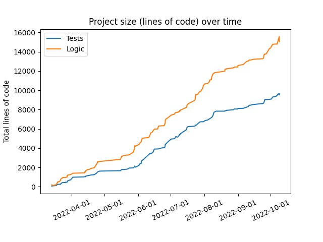
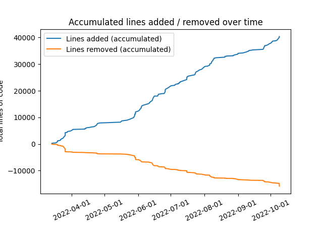

# tinyeth

It's a tiny ETH implementation, but it's starting to grow up.

|                |    |
| :----------------------------------: | :-------------------------------------------: |
|  |  |

## What is it (for real) ? 
It's a playground for me to play with various part of the ETH protocol. The goal is by no means to be a real client, I would never have written a real client in Typescript. 

Typescript is very beginner friendly, so another partial goal is to write the code in a way so it can be used for by others to experiment with the protocol, and provide good unit tests other can reuse.

## What can it do ? 
Most core parts from the yellow paper is more or less implemented :

- Recursive length prefix (RLP), the serialization format used in most of the ETH1 world. 
  - Basic support for simple serialization is also added, which is the new serialization format for ETH2
- Application binary interface (ABI) for allowing users to construct calldata for calling contracts.
- Construction of transactions, and signing transactions.
- EVM is more or less opcode accurate in functionality, but still has some some gas logic missing on some dynamic gas opcodes (the last 5% is the hard part).
- Ethash - the proof of work algorithm used in Eth1.
- Merkle patricia trie (it's like 70% done - need to fix the hashing for instance)

Not in the yellow paper, but still in the protocol: 

One big goal for me was that wanted the "client" to be able to fetch a block from the network. Support for this has been added :')

- Node discovery protocol (discv4) is implemented, and it has support to find neighbor nodes. 
- Node communication format (RLPx) 
- Ethereum wire protocol that builds on top of RLPx, and is for instance used for fetching blocks.

That being said, nodes are not always so happy talking to my client, and might disconnect when they see the useragent. 

## What's next ? 
Instead of aiming at being a 100% accurate complete implementation, I think I will focus more on the aspect where I learn the most. 

Many hours have went into debugging the way dynamic gas cost were calculated for some opcodes, and rereading the spec for specific opcodes. I definitely think there is some value in fixing the remaining EVM bugs, but I also know i'm able to fix them if I want to. It's not technical challenge to solve, the hard problem is already solved.
I rather prove to myself that I can solve harder technical problems, so that will be the focus.

In other words : 

- ETH has merged, and it's time for us to follow. So the plan is to start to focus more on that. Added some links to `src/consensus/readme.md`.
- Complete the merkle patricia trie implementation
- I started on a very wip solidity compiler, two reasons for this, one to learn more about compilers, and two it's a nice way for improved mental mapping between opcodes and solidity.
- I also want to look more into more experimental stuff like stateless clients, zk, various parts of l2s, etc.

## Test status
Ideally all tests from https://github.com/ethereum/tests should be implemented. 

Currently the ABI / RLP are added.
